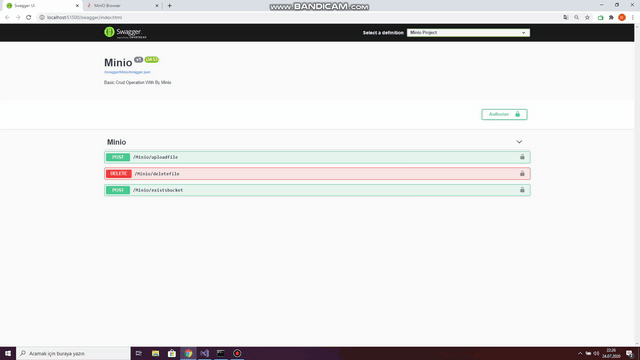

# Minio



### About

Can be called object storage tool for MinIO

### In This Project

- Upload File
- Delete File
- Bucket Inquiry

### Code Example

```csharp
bool response = true;
            try
            {
                bool bucketFound = await minioClient.BucketExistsAsync(bucketName);
                if (!bucketFound)
                    minioClient.MakeBucketAsync(bucketName, "Tr-tr").Wait();
                using (Stream stream = formFile.OpenReadStream())
                {
                    await minioClient.PutObjectAsync(bucketName, fileName, stream, stream.Length);
                }
            }
            catch (Exception ex)
            {
                Console.WriteLine(ex.Message);
                response = false;
            }
            return response;
```
